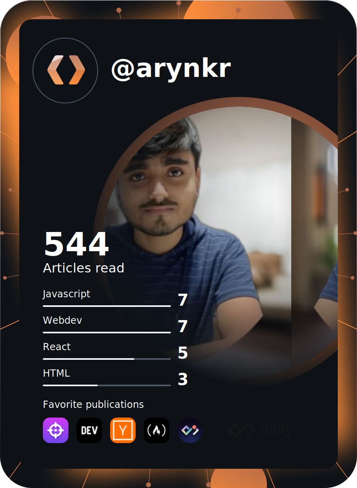

<h2> Hi 👋! &nbspI'm Aryan.</h2>

<h3> 👨🏻‍💻 &nbsp;About Me </h3>
  

- 🤔 &nbsp; Exploring new technologies and developing full-stack, modern and responsive websites.
- 🎓 &nbsp; Studying Information Technology at Heritage Institute of Technology, Kolkata.
<!-- - 💼 &nbsp; Working as a Website Developer at [FindMyRank](https://www.findmyrank.com). -->
- 🌱 &nbsp; Learning more about Web, Mobile Development & PWA's.
- ❤ &nbsp; Love making websites and constantly learning on the way.

<h3> 🛠 &nbsp;Tech Stack</h3>

- 🌐 &nbsp;
  
  
  
  
  
  
- 💻 &nbsp;
  
  
  
- 🛢 &nbsp;
  
  
- ⚙️ &nbsp;
  
  
  
- 🔧 &nbsp;
  
  
  
- 🖥 &nbsp;
  
  
  

 

 

<h3> 🤝🏻 &nbsp;Connect with Me </h3>

⭐️ [See My Projects](https://github.com/ArynKr)
