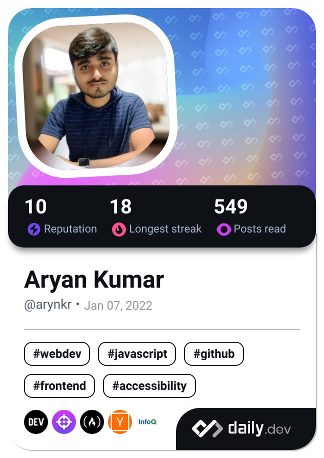

<!--  -->

<!--  -->

 <h1>Hey there , I am Aryan </h1>
  <!--
  
  
  
  -->

<h3> &nbsp;👨‍💻 About Me </h3>

 I specialize in developing full-stack web applications and mobile solutions with   technologies like **Next.js**, **React**, **React Native** and **Node.js**.

<h3> 🛠 &nbsp;Tech Stack</h3>

⚙️ &nbsp;
  
  
  
    
💻 &nbsp;
  
  
    
🛢 &nbsp;
  
  

 

<h3 align="left">Connect with me:</h3>

 

